# Tienda
Python _ DockerFile


> Ingry Nathaly Salamanca Rativa

> Julio Cesar Morales Torres

> Elkin Ortiz Salazar

Diagramas de Arquitectura Poryecto Tienda de Barrio.
```sh

```

## Vista de Aplicación.
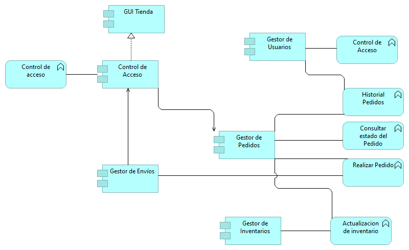

## Vista Contibución de Objetivos
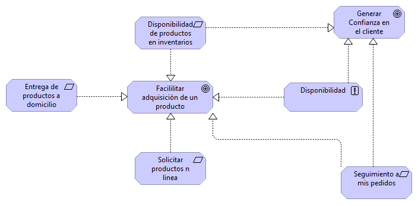

## Cooperación de Actores
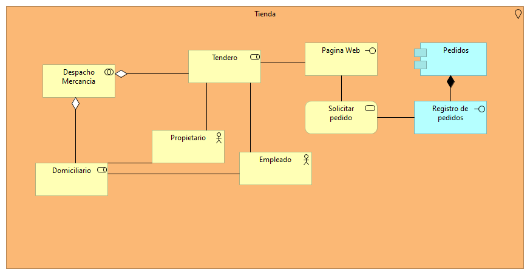

## Cooperación de Proceso de Aplicación
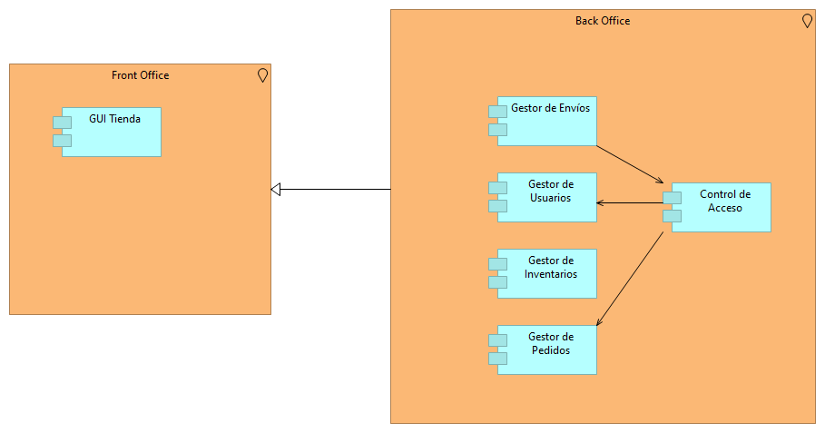

## Cooperación de Proceso de Negocio
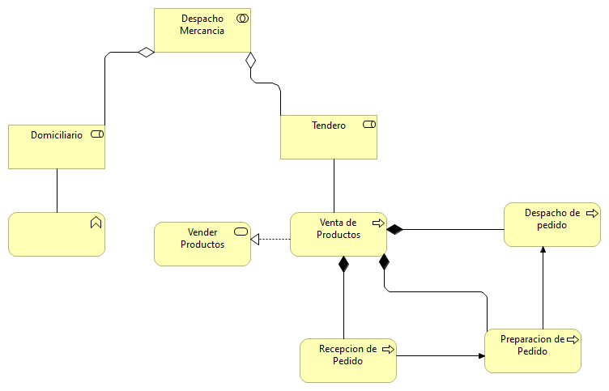

## Estructura de Aplicaciones
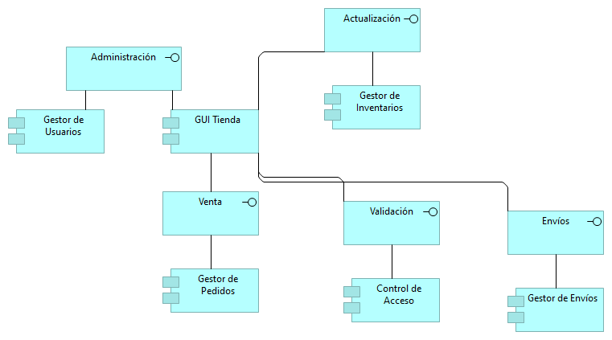

## Funciones del Negocio
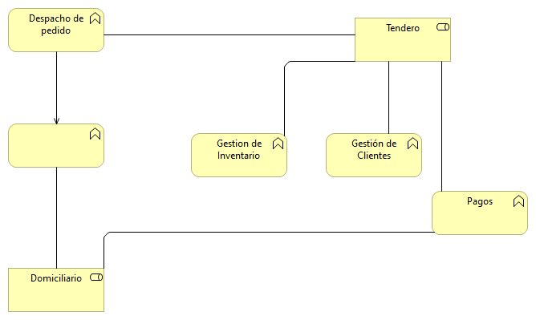

## Infraestructura
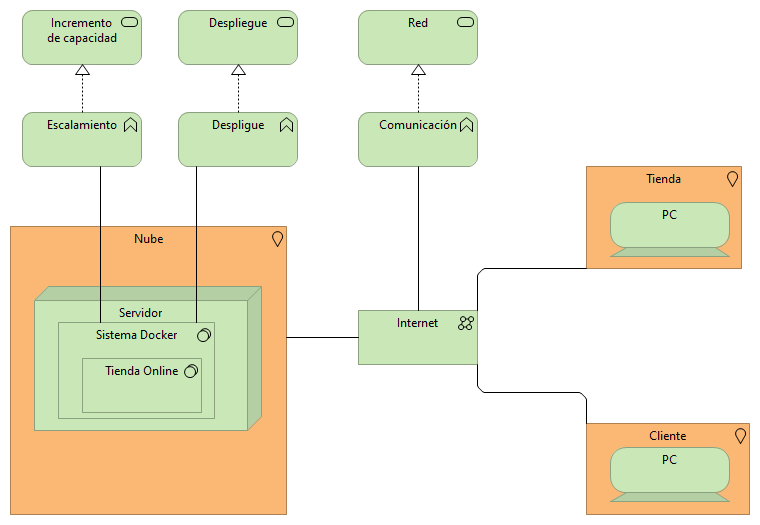

## Motivación
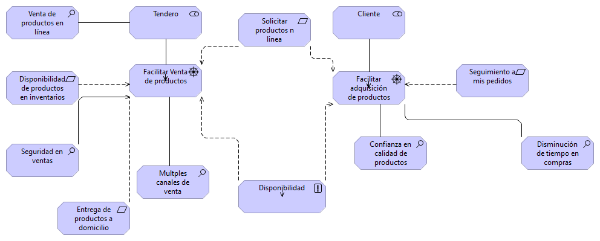

## Organización e Implementación
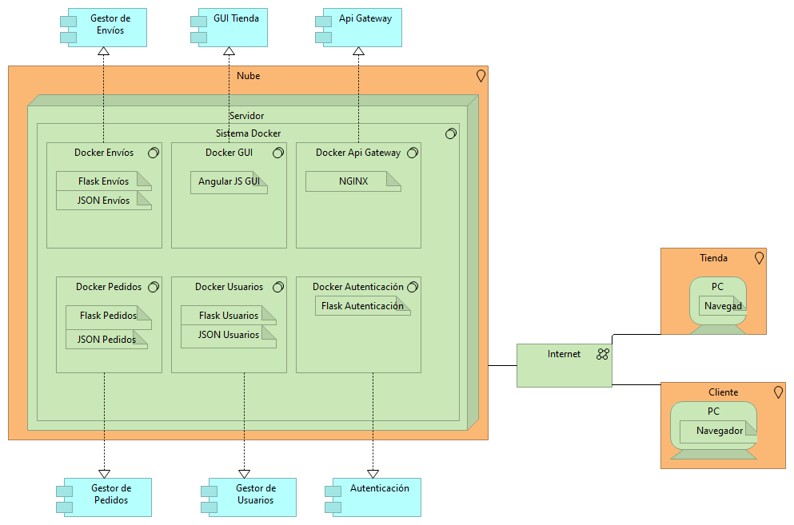

## Procesos de Negocio


## Producto
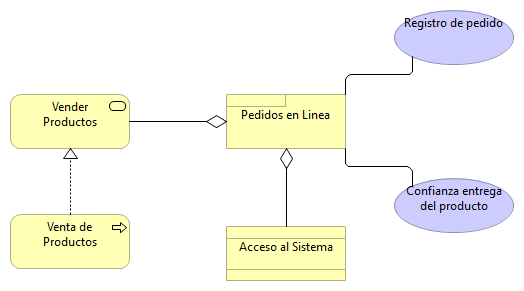

## Realización de requeriminetos
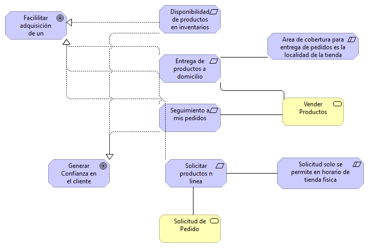

## Realización del Servicio
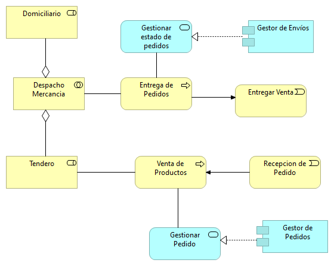

## Resumen por capas


## Uso de Aplicación 
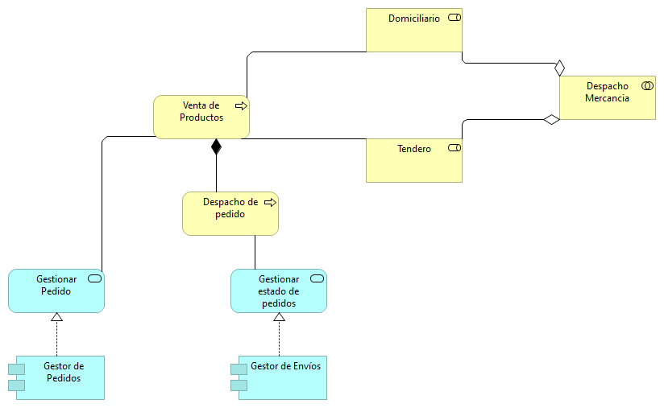

## Uso de infraestructura


